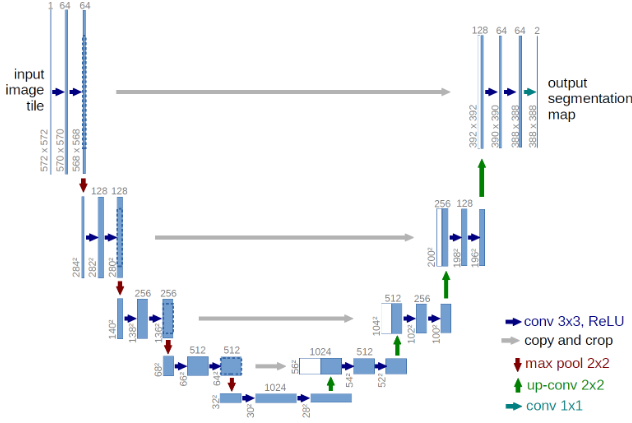
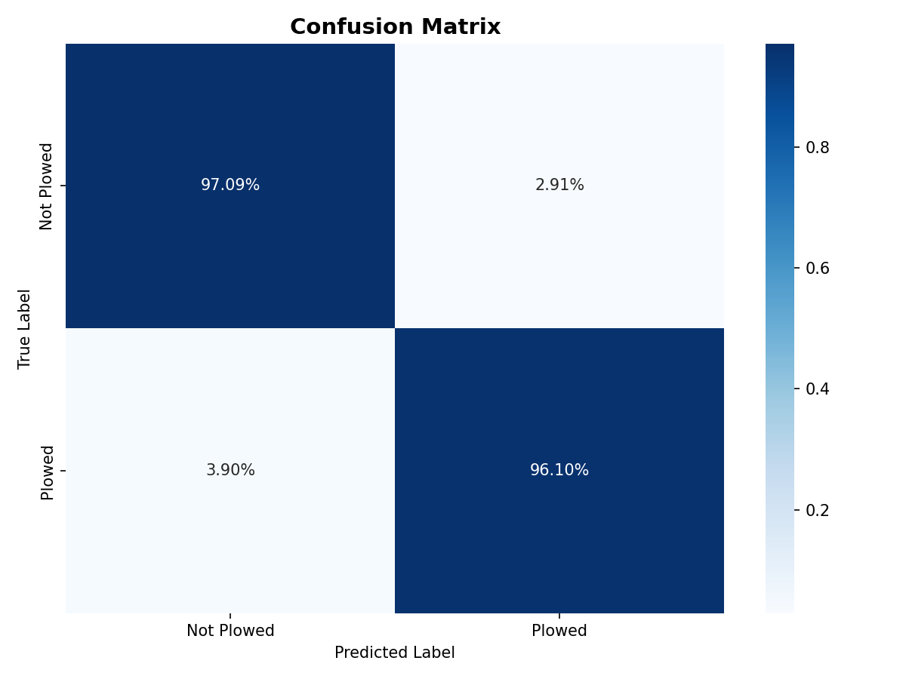
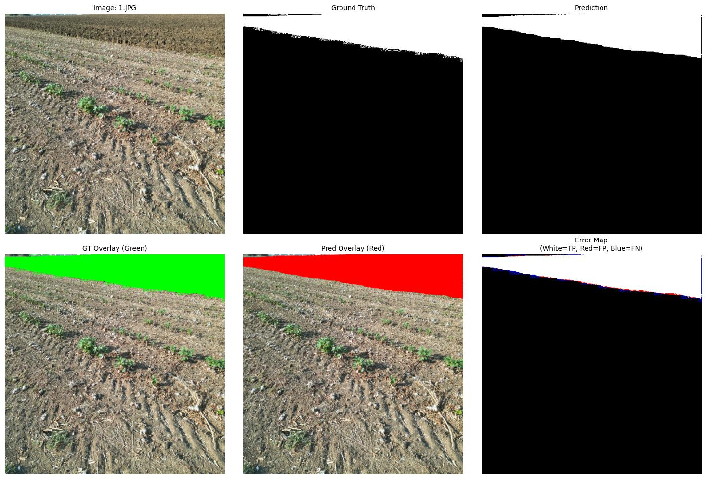
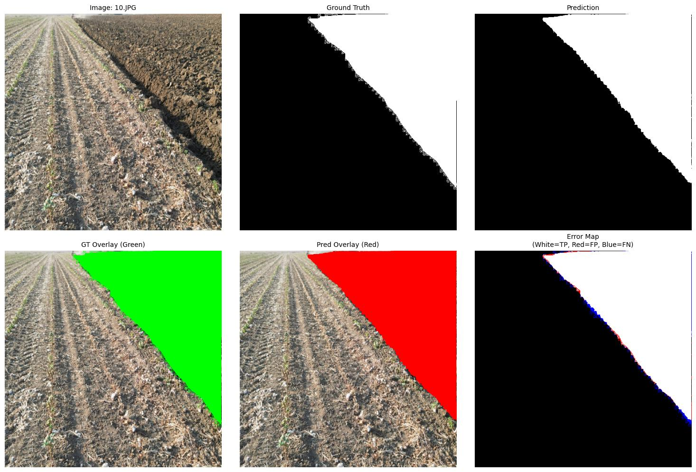

<!-- PROJECT TITLE + HERO -->
<!--<p align="center">
  
</p> -->

<h1 align="center">Unet: Image Segmentation CNN Network</h1>

<p align="center">
A deep learning model for semantic segmentation developed as part of my M.Sc. thesis.
</p>

---

## Overview

This repository contains a Unet training model and data adjustment pipeline developed to segment plowed regions for autonomous navigation in plowed agricultural environment. 

The model is designed for line-following navigation strategy for a battery delivery robot operating in plowing fields. It performs semantic segmentation to extract binary masks from input images, enabling the robot to identify and follow crop rows.

## Key Features

- **Input Processing**: Images are resized to 512×512 pixels for network input
- **Architecture**: Classic Unet convolutional neural network
- **Output**: Binary segmentation masks for path detection
- **Application**: Agricultural robot navigation in field environments


## Installation
```bash
# Clone the repository
git clone git@github.com:omribu/Unet.git
cd Unet
```

## Model Architecture

<p align="center">
  
</p>


The Unet architecture consists of:
- **Encoder**: Downsampling path with convolutional and pooling layers
- **Decoder**: Upsampling path with transposed convolutions
- **Skip Connections**: Concatenating encoder features with decoder features

## Dataset

The model is trained on plowed imagery with annotated crop row segmentation masks.

## Results

### Model Performance

<p align="center">
  
</p>

The model achieves high accuracy in binary segmentation:
- **Not Plowed (Class 0)**: 97.09% correctly classified
- **Plowed (Class 1)**: 96.10% correctly classified
- **Overall**: Strong performance with minimal false positives (2.91%) and false negatives (3.90%)

<p align="center">
  <strong>Image 1 performance</strong>
</p>
<p align="center">
  
</p>

<p align="center">
  <strong>Image 2 performance</strong>
</p>
<p align="center">
  
</p>


Each image shows:
- **Top Left**: Original input image
- **Top Middle**: Ground truth segmentation mask (white = plowed)
- **Top Right**: Model prediction (white = plowed)
- **Bottom Left**: Ground truth overlay (green = correctly classified plowed region)
- **Bottom Middle**: Prediction overlay (red = predicted plowed region)
- **Bottom Right**: Error map (white = true positive, red = false positive, blue = false negative)

